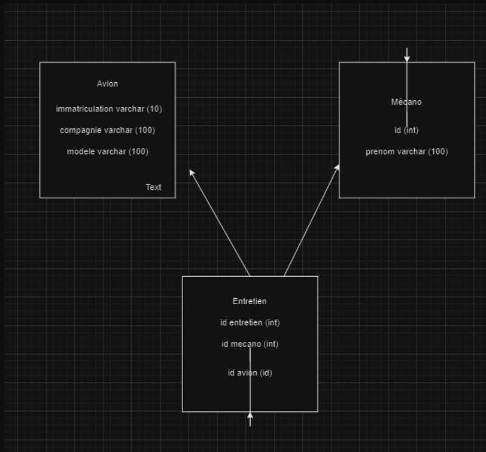

### Note de conception d'architecture

## Mouhamad Fall BTS SIO SLAM

## Liste des endpoints

| **Méthode** | **Endpoint**            | **Paramètres**                           | **Description**                       |
|-------------|--------------------------|------------------------------------------|---------------------------------------|
| `GET`       | `/avions`               | Aucun                                    | Récupère la liste des avions.         |
| `GET`       | `/avions/{id}`          | `id` (int)                               | Récupère les détails d'un avion.      |
| `POST`      | `/avions`               | `model` (varchar), `compagnie` (varchar) | Ajoute un nouvel avion.               |
| `PUT`       | `/avions/{id}`          | `id` (int), `model`, `compagnie`         | Met à jour les informations d'un avion. |
| `DELETE`    | `/avions/{id}`          | `id` (int)                               | Supprime un avion.                    |
| `GET`       | `/mecanos`              | Aucun                                    | Récupère la liste des mécaniciens.    |
| `GET`       | `/mecanos/{id}`         | `id` (int)                               | Récupère les détails d'un mécanicien. |
| `POST`      | `/mecanos`              | `nom` (varchar), `prenom` (varchar)      | Ajoute un nouveau mécanicien.         |
| `PUT`       | `/mecanos/{id}`         | `id` (int), `nom`, `prenom`             | Met à jour les informations d'un mécanicien. |
| `DELETE`    | `/mecanos/{id}`         | `id` (int)                               | Supprime un mécanicien.               |
| `GET`       | `/entretiens`           | Aucun                                    | Récupère la liste des entretiens.     |
| `GET`       | `/entretiens/{id}`      | `id` (int)                               | Récupère les détails d'un entretien.  |
| `POST`      | `/entretiens`           | `avion_id` (int), `mecano_id` (int)      | Ajoute un nouvel entretien.           |
| `PUT`       | `/entretiens/{id}`      | `id`, `avion_id`, `mecano_id`           | Met à jour un entretien.              |
| `DELETE`    | `/entretiens/{id}`      | `id` (int)                               | Supprime un entretien.                |

*  **Modèle conceptuel :**

***Avion***
 
> **id** (int) : Identifiant unique de l'avion
> **model** (varchar) : Modèle de l'avion 
> **compagnie** (varchar) : Compagnie de l'avion
>

 ***Mécano***
 
> **id** (int) : Identifiant unique du technicien
> **nom** (varchar) : Nom du technicien
> **prenom**(varchar) : Prénom du technicien
 
 ***Entretien***
> **id** (int) : Identifiant unique de l'entretien
> **avion_id** (int) : Référence vers l'avion concerné
> **mecano_id** (int) : Référence vers le technicien ayant réalisé l'entretien

## Liste des erreurs possibles

| **Code HTTP** | **Erreur**                     | **Description**                                                                 |
|---------------|--------------------------------|---------------------------------------------------------------------------------|
| 400           | Bad Request                   | La requête est mal formée ou des paramètres sont manquants ou invalides.        |
| 401           | Unauthorized                  | L'utilisateur n'est pas authentifié ou les informations d'identification sont incorrectes. |
| 403           | Forbidden                     | L'utilisateur n'a pas les permissions nécessaires pour effectuer cette action.  |
| 404           | Not Found                     | La ressource demandée (avion, mécanicien ou entretien) est introuvable.         |
| 405           | Method Not Allowed            | La méthode HTTP utilisée (GET, POST, etc.) n'est pas supportée pour cet endpoint. |
| 409           | Conflict                      | Un conflit a été détecté, comme un doublon d'enregistrement (exemple : avion déjà existant). |
| 422           | Unprocessable Entity          | Les données envoyées sont valides mais ne peuvent pas être traitées (exemple : une référence étrangère invalide). |
| 500           | Internal Server Error         | Une erreur interne au serveur est survenue.                                     |
| 502           | Bad Gateway                   | Le serveur a reçu une réponse invalide d'un autre service ou d'une base de données. |
| 503           | Service Unavailable           | Le service est temporairement indisponible (surcharge ou maintenance).          |

